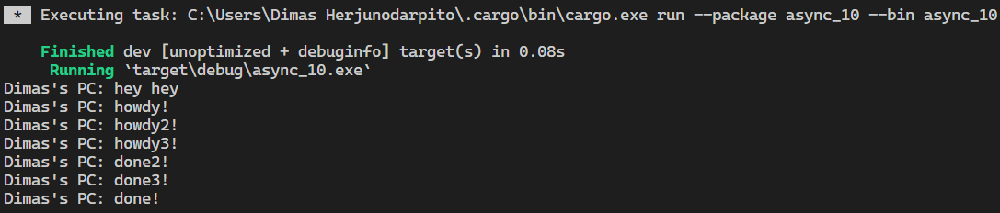

**1.2. Understanding how it works.**  
  
From observing the output, it can be understood that what happens is that the async function will run outside of the main function that runs it. Therefore, "hey hey" could have been output first before "howdy!" and "done!" because "hey hey" is outside the async function because the function will continue the program and run `println!("hey hey");` while the async function is still waiting for the result of future.  

**1.3. Multiple Spawn and removing drop**  
  
From the resulting output, it can be seen that the existence of many spawners causes more tasks to be performed because more tasks are queued into the task sender which acts like a message queue. Not dropping the spawner causes the program to never die because the program assumes that there will still be a data transmission by the spawner. drop(spawner) itself is an indication that the interaction is complete and the spawner will be closed. When a spawner calls the spawn function, it will create a new task that is channeled into the task sender. The executor will take one task from the task sender and execute it and after that take another task until the task runs out and the spawner is dropped which indicates the interaction is complete.  