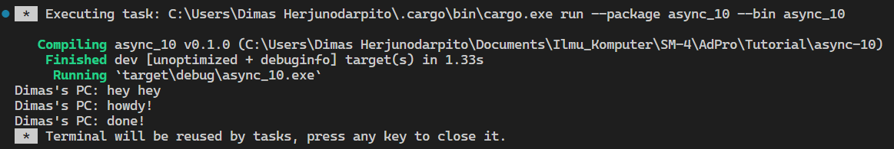

**1.2. Understanding how it works.**  
  
From observing the output, it can be understood that what happens is that the async function will run outside of the main function that runs it. Therefore, "hey hey" could have been output first before "howdy!" and "done!" because "hey hey" is outside the async function because the function will continue the program and run `println!("hey hey");` while the async function is still waiting for the result of future.  

